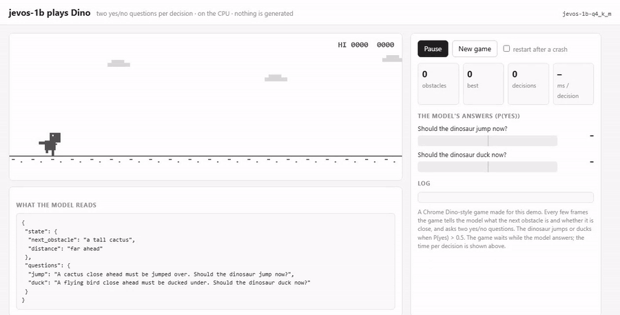
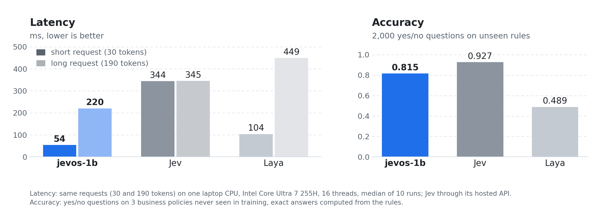

# jevos-1b

**Yes/no decisions on a laptop CPU in 50–220 ms.** Send a text and a yes/no question, get back
P(yes).

<p align="center">
<a href="assets/dino_run.gif"></a>
</p>

## Benchmarks

<picture>
  <source media="(prefers-color-scheme: dark)" srcset="assets/jevos_bench_dark.png" />
  
</picture>

## What each one does

| | **jevos-1b** | Jev | Laya |
|---|:---:|:---:|:---:|
| Yes/no questions | ✓ | ✓ | ✓ |
| Multiple choice | Soon | ✓ | ✓ |
| Scores | Soon | ✓ | ✓ |
| Runs on | your machine | cloud | your machine |
| Cost | free | per token | free |
| Context | 8,192 tokens | not stated | 512 tokens |

## Quickstart

Download `jevos-1b-q4_k_m.gguf` from the [release](https://github.com/feder-cr/jev/releases/tag/jevos-1b), then:

```bash
uv sync
uv run jev download --only runtime        # llama.cpp for this machine
uv run jev serve --gguf jevos-1b-q4_k_m.gguf --device cpu --threads 16
```

```bash
curl http://127.0.0.1:8017/v1/systemone -H 'Content-Type: application/json' -d '{
  "model": "jev-latest",
  "state": "I was charged twice for the same order.",
  "questions": {"billing": {"type": "noul", "instructions": "Is this a billing problem?"}}}'
```

```json
{
  "model": "jevos-1b-q4_k_m",
  "answers": {"billing": {"type": "noul", "noul": 0.9}},
  "usage": {"input_tokens": 27, "output_tokens": 0}
}
```

Then open <http://127.0.0.1:8017/dino> to watch it play.

## API

The server speaks TypeSafe Jev's wire format, so code written for Jev's SDK works unchanged for
yes/no questions.

### `POST /v1/systemone`

| Field | What it is |
|---|---|
| `model` | `jev-latest` (any `jev-*` name works) or the served model's name |
| `state` | the text to decide on: a string, or any JSON object or array |
| `questions` | one or more named questions, each `{"type": "noul", "instructions": "…?"}` |

Every answer is `noul`, the probability that the answer is yes (0 to 1). Questions in the same
request share the state, which is read once: the three questions below take about 165 ms
together, against 103 ms for one of them alone.

```json
{
  "model": "jev-latest",
  "state": {
    "item": "wireless mouse",
    "delivered": "5 days ago",
    "customer_message": "The box arrived empty. This is the second time!"
  },
  "questions": {
    "refund": {
      "type": "noul",
      "instructions": "Our policy refunds items reported missing within 30 days of delivery. Should this customer get a refund?"
    },
    "upset": {"type": "noul", "instructions": "Is the customer upset?"},
    "wrong_item": {"type": "noul", "instructions": "Does the customer say they received the wrong item?"}
  }
}
```

```json
{
  "model": "jevos-1b-q4_k_m",
  "answers": {
    "refund": {"type": "noul", "noul": 0.78},
    "upset": {"type": "noul", "noul": 0.73},
    "wrong_item": {"type": "noul", "noul": 0.1}
  },
  "usage": {"input_tokens": 95, "output_tokens": 0}
}
```

- **Put the rule in the question.** If the decision depends on a policy, write it into
  `instructions`, as in `refund` above. Jev's optional `criteria` field is accepted but not read.
- **Yes/no only.** `choice` and `score` questions are refused with a `422`.
- **Timing.** Every response carries a `Server-Timing` header with the inference time.

### Other endpoints

| Endpoint | Returns |
|---|---|
| `GET /v1/models` | the served model and its `jev-latest` alias |
| `GET /health` | `{"status": "ready", …}` once the model is loaded |

### From Python

```python
import requests

answer = requests.post("http://127.0.0.1:8017/v1/systemone", json={
    "model": "jev-latest",
    "state": "I was charged twice for the same order.",
    "questions": {"billing": {"type": "noul", "instructions": "Is this a billing problem?"}},
}).json()

if answer["answers"]["billing"]["noul"] > 0.5:
    print("send to billing")
```

## Server options

| Option | Default | |
|---|---|---|
| `--gguf` | | path to the model file |
| `--device` | `auto` | `cpu` to stay on the CPU |
| `--threads` | 4 | CPU threads; set it to your core count, fewer if other heavy apps are running |
| `--host`, `--port` | `127.0.0.1`, `8017` | where the server listens |

## Credits

Built together with [Loris Salsi (@LosaLosSantos)](https://github.com/LosaLosSantos).
