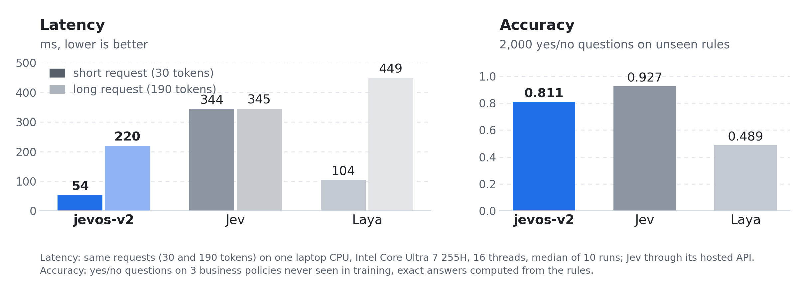

# jevos

**Yes/no decisions on a laptop CPU in 25–110 ms.** Send a text and a yes/no question, get back
P(yes).

<p align="center">
<a href="assets/dino_run.gif"></a>
</p>

## Benchmarks

<picture>
  <source media="(prefers-color-scheme: dark)" srcset="assets/jevos_bench_dark.png" />
  
</picture>

jevos-v2 answers 80.3% of 999 hand-written yes/no questions correctly, against 75.8% for the first
jevos, with the same size and speed.

Latency is the median of 10 requests through the HTTP API, after 3 warm-up requests, on an Intel Core
Ultra 7 255H laptop with 16 threads, each request reading its text from scratch (`--state-cache 0`).
By default the server keeps the texts it has read, so asking about the same text again takes 22 ms for
the long request.

## What each one does

| | **jevos-v2** | Jev | Laya |
|---|:---:|:---:|:---:|
| Yes/no questions | ✓ | ✓ | ✓ |
| Multiple choice | Soon | ✓ | ✓ |
| Scores | Soon | ✓ | ✓ |
| Runs on | your machine | cloud | your machine |
| Cost | free | per token | free |
| Context | 8,192 tokens | not stated | 512 tokens |

## Quickstart

From the [release](https://github.com/feder-cr/jev/releases/tag/jevos-v2), download the archive for your
system (`jev-windows-x64.zip`, `jev-linux-x64.tar.gz` or `jev-macos-arm64.tar.gz`) and the model,
`jevos-v2-openvino-int8.zip`. Unpack the model into the `jev` folder, so that it sits in `jev/model`:

```bash
tar -xzf jev-linux-x64.tar.gz                 # Windows: unzip jev-windows-x64.zip
cd jev
unzip ../jevos-v2-openvino-int8.zip           # creates model/
./jev serve                                   # Windows: jev.exe serve
```

```bash
curl http://127.0.0.1:8017/v1/systemone -H 'Content-Type: application/json' -d '{
  "model": "jev-latest",
  "state": "I was charged twice for the same order.",
  "questions": {"billing": {"type": "noul", "instructions": "Is this a billing problem?"}}}'
```

```json
{
  "model": "jevos-v2",
  "answers": {"billing": {"type": "noul", "noul": 0.94}},
  "usage": {"input_tokens": 27, "output_tokens": 0}
}
```

`jev` runs on the CPU: jevos-v2 with 8-bit weights through [OpenVINO](https://github.com/openvinotoolkit/openvino),
in one binary with no Python and no GPU. The same release has the model as GGUF files
(`jevos-v2-q4_k_m.gguf`, `jevos-v2-q8_0.gguf`) for llama.cpp and the tools built on it.

## API

The server speaks TypeSafe Jev's wire format, so code written for Jev's SDK works unchanged for
yes/no questions.

### `POST /v1/systemone`

| Field | What it is |
|---|---|
| `model` | `jev-latest` (any `jev-*` name works) or the served model's name |
| `state` | the text to decide on: a string, or any JSON object or array |
| `questions` | one or more named questions, each `{"type": "noul", "instructions": "…?"}` |

Every answer is `noul`, the probability that the answer is yes (0 to 1). Questions in the same
request share the state, which is read once: the three questions below take about 66 ms together,
against 49 ms for one of them alone, and 39 ms when the same state is asked about again.

```json
{
  "model": "jev-latest",
  "state": {
    "item": "wireless mouse",
    "delivered": "5 days ago",
    "customer_message": "The box arrived empty. This is the second time!"
  },
  "questions": {
    "refund": {
      "type": "noul",
      "instructions": "Our policy refunds items reported missing within 30 days of delivery. Should this customer get a refund?"
    },
    "upset": {"type": "noul", "instructions": "Is the customer upset?"},
    "wrong_item": {"type": "noul", "instructions": "Does the customer say they received the wrong item?"}
  }
}
```

```json
{
  "model": "jevos-v2",
  "answers": {
    "refund": {"type": "noul", "noul": 0.93},
    "upset": {"type": "noul", "noul": 0.83},
    "wrong_item": {"type": "noul", "noul": 0.04}
  },
  "usage": {"input_tokens": 95, "output_tokens": 0}
}
```

- **Put the rule in the question.** If the decision depends on a policy, write it into
  `instructions`, as in `refund` above. Jev's optional `criteria` field is accepted but not read.
- **Yes/no only.** `choice` and `score` questions are refused with a `422`.
- **Timing.** Every response carries a `Server-Timing` header: parsing, validation, tokenization,
  queue and inference times.

### Other endpoints

| Endpoint | Returns |
|---|---|
| `GET /v1/models` | the served model and its `jev-latest` alias |
| `GET /health` | `{"status": "ready", …}` once the model is loaded |

### From Python

```python
import requests

answer = requests.post("http://127.0.0.1:8017/v1/systemone", json={
    "model": "jev-latest",
    "state": "I was charged twice for the same order.",
    "questions": {"billing": {"type": "noul", "instructions": "Is this a billing problem?"}},
}).json()

if answer["answers"]["billing"]["noul"] > 0.5:
    print("send to billing")
```

### From the command line

`jev decide` answers one request file without starting a server. The file holds the same body as
`POST /v1/systemone`, and the answer comes back in the same shape:

```bash
./jev decide request.json
```

`--output answer.json` writes the answer to a new file instead of printing it; an existing file is
never overwritten. A request the server would refuse prints the same error body on stderr, with exit
status 1.

## Server options

| Option | Default | |
|---|---|---|
| `--model-dir` | `model` beside the binary | the model folder |
| `--threads` | all logical CPUs | CPU threads; fewer if other heavy apps are running |
| `--host`, `--port` | `127.0.0.1`, `8017` | where the server listens |
| `--state-cache`, `--state-cache-tokens` | 16, 8,192 | texts kept for later requests, how many and how many tokens in all; 0 turns it off |
| `--batch-tokens` | 384 | small requests arriving together are read in one model call while their tokens fit |

With `JEV_API_KEY` set, every call but `/health` needs `Authorization: Bearer <key>`. The server needs about
1 GB of memory once the model is loaded, up to 1.4 GB with its cache of recent texts full. `/health`
reports the SHA-256 of each model file and a fingerprint of them all (`model_files`, `fingerprint`), so a
logged decision can be tied to the exact model that made it.

## Build from source

```bash
python -m pip install -r requirements.txt     # OpenVINO's SDK, CMake, Ninja, the tests' packages
python scripts/build.py                       # dist/jev; on Windows, from a Visual Studio developer prompt
python tests/check.py                         # with the model in dist/jev/model
```

A C++17 compiler is the only other requirement; CMake fetches llama.cpp (the tokenizer) itself.
`export/export_openvino.py` is how the model folder was made from the trained weights.

## Guides

The [wiki](https://github.com/feder-cr/jev/wiki) has the long version:
[zero-shot text classification with yes/no questions](https://github.com/feder-cr/jev/wiki/zero-shot-text-classification-yes-no-questions),
[LLM as a judge on a CPU](https://github.com/feder-cr/jev/wiki/llm-as-a-judge-on-a-cpu),
[policy decisions](https://github.com/feder-cr/jev/wiki/llm-policy-decisions-put-the-rule-in-the-question),
and what we measured about the model, including
[why a small LLM says yes when the answer is no](https://github.com/feder-cr/jev/wiki/why-a-small-llm-says-yes).

## Credits

Built together with [Loris Salsi (@LosaLosSantos)](https://github.com/LosaLosSantos).
