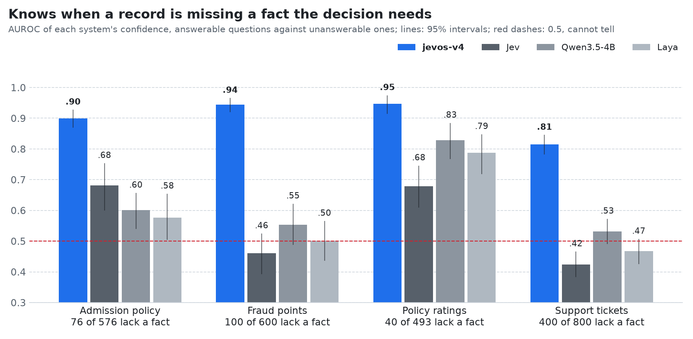

# jevos

**Decisions on a laptop CPU in 28–130 ms.** Send a text and a question (yes/no, multiple choice or a
score) and get back the probability of each answer, in TypeSafe Jev's API, on your own machine.

<p align="center">
<a href="assets/dino_run.gif"></a>
</p>

## Benchmarks


Every system gets the same questions through the same HTTP client; the right answers come from the rules
themselves, from the datasets' annotators or from experts. The six tasks: admission and rental policies,
government rules ([ShARC](https://huggingface.co/datasets/UCLNLP/sharc)), approval authority
([SemIf](https://github.com/TheoLeeCJ/SemIf)), fraud risk points, and how close two patent phrases are
([Patent Phrase Similarity](https://huggingface.co/datasets/tasksource/patent-phrase-similarity)). None of
these texts was used to train jevos; five of the six sets helped choose the released checkpoint, so its
scores there may be slightly optimistic.

Latency is the median of 10 requests after 3 warm-up requests, on an Intel Core Ultra 7 255H laptop with 16
threads, each text read from scratch, measured with jevos-v3, which has the same size and speed as jevos-v4.
Asking about the same text again takes 22 ms for the long request.

### When a fact is missing



When a record lacks a fact the decision needs, no answer can be right, and a good system says it is unsure.
With the fact missing, jevos-v4 still answers with 75% confidence or more on 0–42% of these questions, Jev on
60–71%. The two [sys1bench](https://pypi.org/project/sys1bench/) sets were never used to train or choose jevos.

## What each one does

| | **jevos-v4** | Jev | Laya |
|---|:---:|:---:|:---:|
| Yes/no questions | ✓ | ✓ | ✓ |
| Multiple choice | ✓ | ✓ | ✓ |
| Scores | ✓ (early) | ✓ | ✓ |
| Runs on | your machine | cloud | your machine |
| Cost | free | per token | free |
| Context | 8,192 tokens | not stated | 512 tokens |

## Quickstart

From the [release](https://github.com/feder-cr/jev/releases/tag/jevos-v4), download the archive for your
system (`jev-windows-x64.zip`, `jev-linux-x64.tar.gz` or `jev-macos-arm64.tar.gz`) and the model,
`jevos-v4-openvino-int8.zip`. Unpack the model into the `jev` folder, so that it sits in `jev/model`:

```bash
tar -xzf jev-linux-x64.tar.gz                 # Windows: unzip jev-windows-x64.zip
cd jev
unzip ../jevos-v4-openvino-int8.zip           # creates model/
./jev serve                                   # Windows: jev.exe serve
```

```bash
curl http://127.0.0.1:8017/v1/systemone -H 'Content-Type: application/json' -d '{
  "model": "jev-latest",
  "state": "I was charged twice for the same order.",
  "questions": {"billing": {"type": "noul", "instructions": "Is this a billing problem?"}}}'
```

```json
{
  "model": "jevos-v4",
  "answers": {"billing": {"type": "noul", "noul": 0.94}},
  "usage": {"input_tokens": 27, "output_tokens": 0}
}
```

`jev` runs on the CPU: jevos-v4 with 8-bit weights through [OpenVINO](https://github.com/openvinotoolkit/openvino),
in one binary with no Python and no GPU. The same release has the model as GGUF files
(`jevos-v4-q4_k_m.gguf`, `jevos-v4-q8_0.gguf`) for llama.cpp and the tools built on it.

## API

The server speaks TypeSafe Jev's wire format, so code written for Jev's SDK works unchanged for
yes/no questions.

`POST /v1/systemone` takes a `model` (`jev-latest`), a `state` (the text, or any JSON) and named
`questions`. Questions in one request share the state, which is read once.

```json
{
  "model": "jev-latest",
  "state": {"item": "wireless mouse", "customer_message": "The box arrived empty. This is the second time!"},
  "questions": {
    "refund": {"type": "noul", "instructions": "Our policy refunds items reported missing within 30 days of delivery. Should this customer get a refund?"},
    "team": {"type": "choice", "instructions": "Which team should handle this message?",
             "criteria": {"billing": "payments, invoices, refunds", "shipping": "deliveries, missing or damaged parcels", "tech": "a product that does not work"}},
    "anger": {"type": "score", "instructions": "How angry is the customer?", "criteria": ["calm", "annoyed", "angry", "furious"]}
  }
}
```

- **`noul`** returns P(yes), from 0 to 1.
- **`choice`** returns the most probable option, a probability per option and a `confidence`.
- **`score`** returns the expected level, a probability per level and a `confidence`; levels go lowest first.

`choice` and `score` list their options or levels in `criteria`; on a `noul`, `criteria` is accepted but not read.

Put the rule in the question: if a decision depends on a policy, write it into `instructions`. A low
`confidence` means the model cannot tell; send those answers to a person. For points that add up, such as a
fraud score, compute the sum in code and ask jevos the parts as yes/no questions.

`GET /v1/models` lists the served model, `GET /health` reports readiness and the SHA-256 of the model files.
Every response carries a `Server-Timing` header. `./jev decide request.json` answers a request file without
a server.

## Server options

| Option | Default | |
|---|---|---|
| `--model-dir` | `model` beside the binary | the model folder |
| `--name` | the name in `model/model.json` | the served model's name |
| `--threads` | all logical CPUs | CPU threads; fewer if other heavy apps are running |
| `--host`, `--port` | `127.0.0.1`, `8017` | where the server listens |
| `--ctx` | 8,192 | most tokens in one question's prompt (the state plus that question) |
| `--state-cache`, `--state-cache-tokens` | 16, 8,192 | texts kept for later requests, how many and how many tokens in all; 0 turns it off |
| `--batch-tokens` | 384 | small requests arriving together are read in one model call while their tokens fit; at most 1,024 |
| `--warmup` | 384 | prompt lengths from 1 to this many tokens are compiled while the server is idle; at most 384, 0 turns it off |
| `--dynamic-quantization` | 128 | activations in INT8 groups of this many values; 0 keeps them f32, slower |

With `JEV_API_KEY` set, every call but `/health` needs `Authorization: Bearer <key>`. The server needs about
1 GB of memory, up to 1.4 GB with its cache of recent texts full.

## Build from source

```bash
python -m pip install -r requirements.txt     # OpenVINO's SDK, CMake, Ninja, the tests' packages
python scripts/build.py                       # dist/jev; on Windows, from a Visual Studio developer prompt
python tests/check.py                         # with the model in dist/jev/model
```

A C++17 compiler is the only other requirement; CMake fetches llama.cpp (the tokenizer) itself.
`export/export_openvino.py` is how the model folder was made from the trained weights.

## Guides

The [wiki](https://github.com/feder-cr/jev/wiki) has the long version:
[zero-shot text classification with yes/no questions](https://github.com/feder-cr/jev/wiki/zero-shot-text-classification-yes-no-questions),
[LLM as a judge on a CPU](https://github.com/feder-cr/jev/wiki/llm-as-a-judge-on-a-cpu),
[policy decisions](https://github.com/feder-cr/jev/wiki/llm-policy-decisions-put-the-rule-in-the-question),
and what we measured about the model, including
[why a small LLM says yes when the answer is no](https://github.com/feder-cr/jev/wiki/why-a-small-llm-says-yes).

## Credits

Built together with [Loris Salsi (@LosaLosSantos)](https://github.com/LosaLosSantos).
