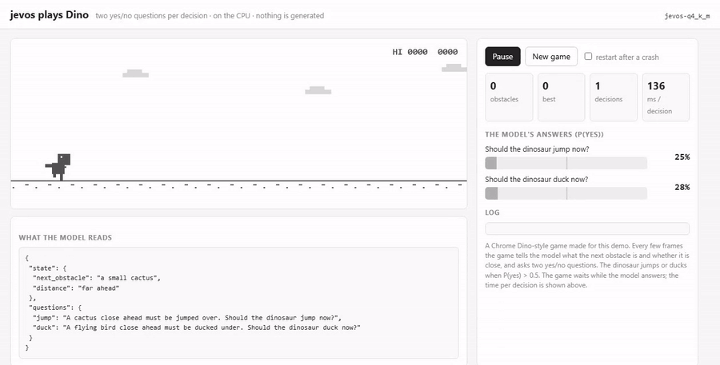
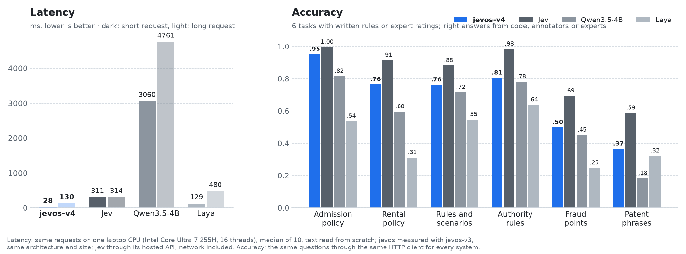

<div align="center">
<picture>
  <source media="(max-width: 374px) and (prefers-color-scheme: dark)" srcset="https://raw.githubusercontent.com/feder-cr/jev/main/assets/banner-small-dark.gif">
  <source media="(max-width: 374px)" srcset="https://raw.githubusercontent.com/feder-cr/jev/main/assets/banner-small-light.gif">
  <source media="(max-width: 1239px) and (prefers-color-scheme: dark)" srcset="https://raw.githubusercontent.com/feder-cr/jev/main/assets/banner-phone-dark.gif">
  <source media="(max-width: 1239px)" srcset="https://raw.githubusercontent.com/feder-cr/jev/main/assets/banner-phone-light.gif">
  <source media="(prefers-color-scheme: dark)" srcset="https://raw.githubusercontent.com/feder-cr/jev/main/assets/banner-dark.gif">
  
</picture>
</div>

**Decisions on a laptop CPU in 28–130 ms.** Send a text and a question (yes/no, multiple choice or a
score) and get back the probability of each answer, in TypeSafe Jev's API, on your own machine.

<p align="center">
<a href="assets/dino_run.gif"></a>
</p>

## Quickstart

From the [release](https://github.com/feder-cr/jev/releases/tag/jevos-v4), download the archive for your
system and `jevos-v4-openvino-int8.zip`, then:

```bash
tar -xzf jev-linux-x64.tar.gz                 # Windows: unzip jev-windows-x64.zip
cd jev
unzip ../jevos-v4-openvino-int8.zip           # creates model/
./jev serve                                   # Windows: jev.exe serve
```

The model is also on Hugging Face, [feder-cr/jevos-v4](https://huggingface.co/feder-cr/jevos-v4):
`hf download feder-cr/jevos-v4 --include "model/*" --local-dir jev` puts it in `jev/model/`.

```bash
curl http://127.0.0.1:8017/v1/systemone -H 'Content-Type: application/json' -d '{
  "model": "jev-latest",
  "state": "I was charged twice for the same order.",
  "questions": {"billing": {"type": "noul", "instructions": "Is this a billing problem?"}}}'
```

```json
{"model": "jevos-v4", "answers": {"billing": {"type": "noul", "noul": 0.94}}, "usage": {"input_tokens": 27, "output_tokens": 0}}
```

One binary, CPU only, no Python. The release and the Hugging Face repo also have the model as GGUF for
llama.cpp.

## Benchmarks



Same questions for every system, through the same HTTP client. Latency is the median of 10 requests on an
Intel Core Ultra 7 255H laptop, 16 threads, each text read from scratch. No task text was used to train
jevos; five of the six sets helped choose the released checkpoint.

| | **jevos-v4** | Jev | Laya |
|---|:---:|:---:|:---:|
| Yes/no questions | ✓ | ✓ | ✓ |
| Multiple choice | ✓ | ✓ | ✓ |
| Scores | ✓ (early) | ✓ | ✓ |
| Runs on | your machine | cloud | your machine |
| Cost | free | per token | free |
| Context | 8,192 tokens | not stated | 512 tokens |

## API

`POST /v1/systemone`, in TypeSafe Jev's wire format: code written for Jev's SDK works unchanged for yes/no
questions. One request can ask several questions about the same text, which is read once:

```json
{
  "model": "jev-latest",
  "state": {"item": "wireless mouse", "customer_message": "The box arrived empty. This is the second time!"},
  "questions": {
    "refund": {"type": "noul", "instructions": "Our policy refunds items reported missing within 30 days of delivery. Should this customer get a refund?"},
    "team": {"type": "choice", "instructions": "Which team should handle this message?",
             "criteria": {"billing": "payments, refunds", "shipping": "deliveries, missing parcels", "tech": "a product that does not work"}},
    "anger": {"type": "score", "instructions": "How angry is the customer?", "criteria": ["calm", "annoyed", "angry", "furious"]}
  }
}
```

A `noul` returns P(yes); a `choice` the most probable option; a `score` the expected level. Choices and scores
also return a probability per answer and a `confidence`: when it is low, send the case to a person. Put the
rule in the question, and do sums in code.

`GET /health` reports readiness and the SHA-256 of the model files; `./jev decide request.json` answers a
request file without a server.

## Options

| Option | Default | |
|---|---|---|
| `--threads` | all logical CPUs | fewer if other heavy apps are running |
| `--host`, `--port` | `127.0.0.1`, `8017` | where the server listens |
| `--model-dir` | `model` beside the binary | the model folder |

With `JEV_API_KEY` set, every call but `/health` needs `Authorization: Bearer <key>`. About 1 GB of memory,
1.4 GB with the text cache full. Every option is described at the top of [src/main.cpp](src/main.cpp).

## Build from source

```bash
python -m pip install -r requirements.txt     # OpenVINO's SDK, CMake, Ninja, the tests' packages
python scripts/build.py                       # dist/jev; on Windows, from a Visual Studio developer prompt
python tests/check.py                         # with the model in dist/jev/model
```

## More

Guides and measurements are in the [wiki](https://github.com/feder-cr/jev/wiki). Built together with
[Loris Salsi (@LosaLosSantos)](https://github.com/LosaLosSantos).
